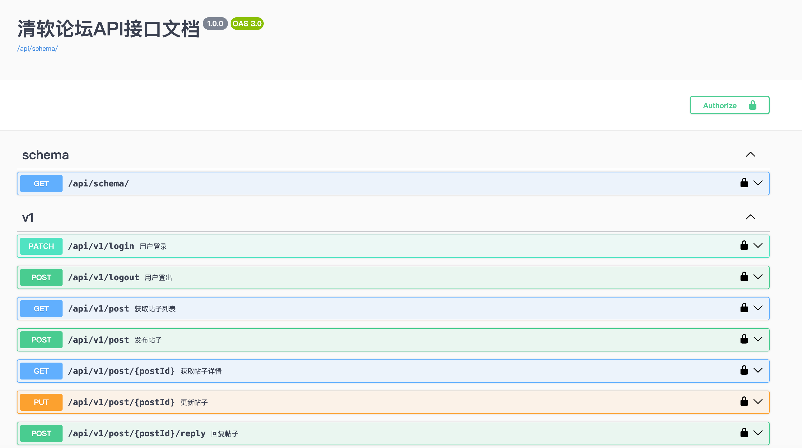

# 清软论坛说明

清软论坛项目后端部分依赖 `Django 4.2.5`、`djangorestframework 3.15.2` 及 `Python 3.8.x`，前端部分依赖 `React` 和 `node 18.x.x`

项目分为前端和后端，前端代码在 `frontend` 目录下，后端代码在 `backend` 目录下

## 前端
!!! info "注意"
    请确保以下命令在 `frontend` 目录下执行
### 开发启动前端

安装依赖
```shell
$ npm install --package-lock=package-lock.json
```
启动开发服务器
```shell
$ npm start
```
浏览器上访问 `localhost:3000` 即可看到项目主页

### 构建前端

```shell
$ npm run build
```
构建后的文件在 `frontend/build` 目录下，可以使用 Nginx 等 Web 服务器进行部署

## 后端
!!! info "注意"
    请确保以下命令在 `backend` 目录下执行
### 安装依赖
安装项目所需的依赖库：

```shell
$ pip install -r requirements.txt
```

### 数据库初始化

在启动服务器之前，需要对数据库进行初始化

1. 生成数据库迁移文件：在 `user` 和 `post` 目录下各生成一个 `migrations` 文件夹，用于记录数据库的迁移历史
```shell
$ python manage.py makemigrations app user post
```
2. 执行数据库迁移：生成迁移文件后，执行以下命令将数据库结构更新到最新版本：
```shell
$ python manage.py migrate
```
3. 填充虚假数据（可选）：执行以下命令将数据库填充虚假数据，生成一个用户名和密码均为 `test_thss` 的用户
```shell
$ python manage.py init_db
```


### 启动开发服务器
#### 创建超级用户
使用如下命令创建超级用户
```shell
$ python manage.py createsuperuser
```
按照提示输入用户名和密码

#### 启动服务器

```shell
$ python manage.py runserver
```

浏览器上访问 `localhost:8000/admin` 即可进入 Django 后台管理界面，使用先前创建的超级用户登录

#### Swagger API 文档
项目使用 `drf-spectacular` 生成 API 文档，供开发者查看，访问 `localhost:8000/api/schema/swagger-ui/` ，使用先前创建的超级用户登录即可查看 API 文档

<figure markdown="span">

<figcaption>Swagger API 文档</figcaption>
</figure>

API 文档中包含了所有的 API 接口，可以查看每个接口的请求方法、请求参数、返回值等信息，也可以**直接在页面上进行测试**

!!! tip "Swagger API 使用指南"
    在清软论坛中，只有注册和登录接口不需要认证，其他接口都需要认证后才可以正常访问。认证的具体步骤如下：

    1. 在用户登录接口中提交用户名和密码，执行成功后获取到返回数据中的 `jwt` 字段
    2. 点击页面右上角的 `Authorize` 按钮，在弹出的对话框中输入获取到的 `jwt` 值，并点击 `Authorize` 完成认证。
    3. 认证成功后，可以在页面上以认证用户的身份访问其他API接口

    如需重新认证，可以点击 `Authorize` 中的 `Logout` 按钮，退出当前认证状态后重新输入 `jwt` 字段的值

### 测试

使用下列命令运行单元测试、集成测试和端到端测试
```shell
$ python manage.py test --filter test_basic
$ python manage.py test --filter test_api
$ python manage.py test --filter test_e2e
```

### 部署

测试环境下使用的是 SQLite 数据库，生产环境下使用的是 MySQL 数据库。

首先启动 MySQL 服务器，并创建数据库 `thss`。

接下来在 `app/settings_prod.py` 中配置 MySQL 数据库的连接信息，然后使用如下命令初始化数据库
```shell
$ python manage.py migrate --settings=app.settings_prod
```

#### Gunicorn 启动
在 `backend` 目录下，使用下列命令启动 Gunicorn 服务器
```shell
$ DJANGO_SETTINGS_MODULE=app.settings_prod gunicorn -w4 -b 0.0.0.0:8000 --log-level=debug app.wsgi
```

