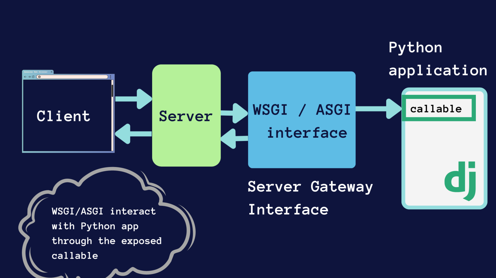
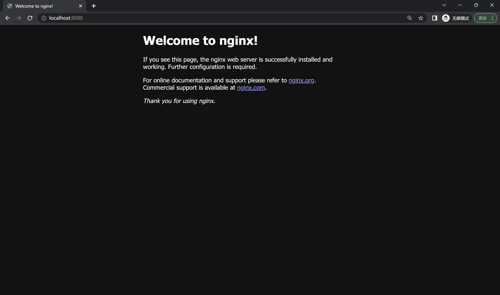
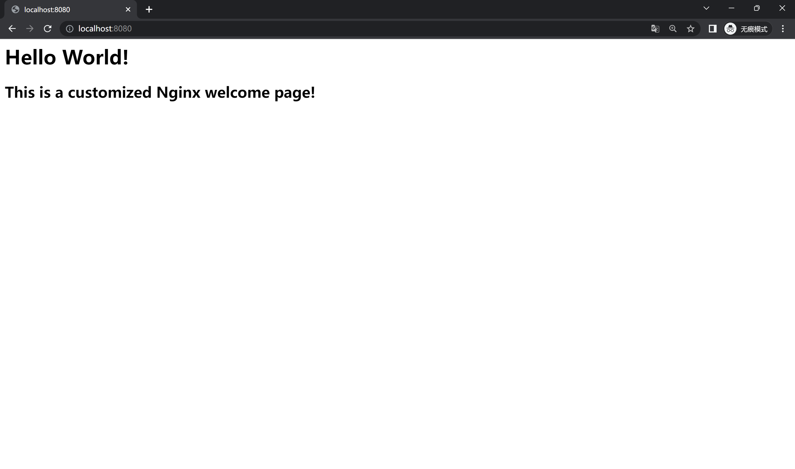

# 应用部署（Docker）

## Web 请求处理流程
HTTP（超文本传输协议，HyperText Transfer Protocol）是一种用于传输超媒体文档的应用层面向对象协议。超媒体文档是一种结构化的文档，它可以包含文本、图片、视频、音频等多种类型的数据，典型代表是 HTML 文档。

HTTP 是互联网上最广泛使用的应用层协议，因其简洁和高效，广泛应用于分布式信息系统中的数据传输。现在，当我们浏览网页时，背后正是 HTTP 协议在起作用。

HTTP 采用 C/S（客户端-服务器，Client-Server）模型，这一模型中存在两个不对等的角色：**客户端**和**服务器**。其中服务器为客户端提供数据或服务，这种模型中的两个主要组件——客户端和服务器——都可以**运行在同一台计算机**上，也可以在**两台连接到网络的不同计算机上**运行。此模型广泛应用于网络服务和分布式应用。

- 客户端 (Client): 是请求服务的实体。通常，它是一个终端用户设备，如计算机、移动设备或任何可以连接到服务器并请求服务的设备。在 Web 上，浏览器常常作为客户端来请求网页和其他 Web 资源。
- 服务器 (Server): 是提供服务的实体。它拥有存储数据的资源并能够处理客户端的请求。服务器可以提供多种服务，如文件服务、打印服务、网络服务或数据库服务。

<figure markdown>
{ loading=lazy }
<figcaption>基于请求-应答的 C/S 模型架构图</figcaption>
</figure>

在一次 HTTP 的请求过程中，主要有三个步骤

1. 请求: 客户端发送一个 HTTP 请求到服务器。
2. 处理: 服务器接收请求并对其进行处理。这可能涉及到数据检索、计算或对其他资源的访问。
3. 响应: 服务器将结果或请求的数据发送回客户端。

在此架构中，服务器端配备了一个 Web 服务器软件，其职责是接受客户端的 HTTP 请求并将之路由至相应的后端应用程序（可能是**另一个进程或另一台机器**）处理。当应用程序完成处理并生成响应后，该响应首先传递给 Web 服务器，随后由 Web 服务器统一返回至客户端。

这里使用的 Web 服务器软件通常是**独立于应用程序的**，它们可以独立运行，也可以作为应用程序的一部分运行。它们可以是 Apache、Nginx、IIS 等。这些 Web 服务器软件可以处理 HTTP 请求、提供静态资源、执行安全检查、管理负载均衡等。它们还可以提供额外的安全层，以保护应用程序免受恶意攻击。

## Nginx 简介
[Nginx](http://nginx.org/en/docs/install.html) 是一种高效的 HTTP 和反向代理服务器。在生产环境中使用 Nginx，可以帮助处理和平衡进入应用程序的流量，还能提供额外的安全层。它可以接收到客户端的请求，并将其转发到后台服务器，然后再将后台服务器的响应转发给客户端。你可以参考这个博客了解更多：[Nginx使用教程](https://juejin.im/post/6844903944267759624)。

Nginx 可以扮演上文提到的 Web 服务器的角色，即接收来自客户端的请求，并返回响应。在本次作业中，它主要用来实现两个功能，静态文件服务和反向代理。

假设你需要管理一系列静态资源，如图片、视频、CSS 样式表和 JavaScript 脚本。为了让这些资源能在 Web 上被用户访问和使用，你需要一个合适的方法来高效地提供这些文件。此时，Nginx 作为一个强大的 Web 服务器，正是你理想的选择来托管和分发这些静态内容。

随着应用的扩展和用户访问量的增长，仅仅提供静态资源可能并不足够。有时，你的应用可能分布在多个服务器或服务上，或者你可能希望通过某种机制对来自客户端的请求进行预处理和路由。这正是反向代理发挥作用的地方，它能够根据规则将请求转发到不同的后端服务器，从而实现负载均衡和高可用性。

考虑下面的 Nginx 配置文件
```nginx
server {
  listen 8000;
  server_name localhost;

  # 静态文件服务
  location /static {
    autoindex on;
    alias /code/static;
  }

  # 代理
  location /api {
    proxy_pass http://111.111.111.112:8000;
  }
}
```

当你在一台机器上（IP 地址为 `111.111.111.112`）启动 Django 后端应用，在另一台机器上（IP 地址为 `111.111.111.111`）启动 Nginx，Nginx 会监听 8000 端口，当有请求到达时，会根据请求的 **URL 路径**来进行不同的处理：

- 当访问的路由为 `http://111.111.111.111:8000/static/index.html` 时，Nginx 会匹配到第一个 `location` 块，然后在本机的 `/code/static` 目录下查找 `index.html` 文件，如果找到了，就将其返回给客户端。即实现了静态文件服务。
- 当访问的路由为 `http://111.111.111.111:8000/api/hello` 时，Nginx 会匹配到第二个 `location` 块，然后将请求转发到运行 Django 应用的机器上，等待后端应用处理完毕后，再将响应返回给客户端。即实现了反向代理。

<figure markdown>
{ loading=lazy }
<figcaption>Nginx 的模式</figcaption>
</figure>


## 部署简介
应用部署是指将开发的应用程序（上文中提到的 Web 服务器和后端应用程序）从开发环境迁移到生产环境的过程，以便最终用户能够访问和使用。

以 Python Web 项目为例，在生产环境中，一般需要使用 Nginx 做反向代理服务器。

在 Python Web 应用的部署过程中，我们经常会遇到这样的需求：既需要能处理 HTTP 请求/响应等底层网络协议的 Web 服务器（如 Nginx 或 Apache），又需要执行 Python 代码逻辑的应用服务器。但是，Web 服务器一般并不擅长直接运行 Python 代码，而 Python 应用则无法直接处理底层的 HTTP 请求。这就需要一个中间层来进行桥接。WSGI 服务器扮演了这一角色，它的作用就是接收来自 Web 服务器（如 Nginx）的请求，然后将这些请求转发给 Python 应用程序，同时，Python 应用程序的响应也会经过 WSGI 服务器，再返回给 Web 服务器，最终再由 Web 服务器返回给用户。

以 [Gunicorn WSGI](https://gunicorn.org/) 服务器为例，它是一个 Python WSGI HTTP 服务器，使用四个 worker 进程来运行 Web 应用，以提高服务器的并发处理能力：
``` { .bash .copy }
$ gunicorn -w4 myapp:app
```

这样部署的部署方式最终形成了下图所示的架构：
 

由此可见，在生产环境中部署 Web 应用程序远比在本地运行更为复杂。不仅需要部署应用本身，还需要配置和管理诸如 Nginx 这样的 Web 服务器和 Gunicorn 这样的 WSGI 服务器，这些都是生产环境中必不可少的组件。同时，还需要处理安全性、可扩展性、日志管理、错误监控等问题。而且，还需要考虑到数据库、缓存、消息队列等其他依赖服务的配置和管理。所有这些因素都使得应用部署变得相当复杂，需要精心的规划和严谨的操作。虽然这需要付出更多的努力，但这是为了确保应用在生产环境中的稳定性和可用性。

## 传统部署中的挑战与困扰
在互联网的早期，部署是一个手动、耗时且容易出错的过程。开发者需要在生产服务器上手动安装必要的软件，配置系统和应用设置，然后将应用代码从版本控制系统中拉取或者复制过去，最后手动启动应用。这种方法存在诸多问题：

1. **环境配置的复杂性**：环境配置的过程可能十分繁琐，尤其是当依赖库之间存在严重耦合时。这不仅会导致部署过程的困难，也会增大交接和沟通的成本，因为每次变更或者新人接手都需要完全理解所有配置和依赖关系。
2. **服务器崩溃和迁移的问题**：如果服务器突然崩溃，或者需要迁移到新的集群，常常需要重新部署应用，这可能会耗费大量的时间和精力。
3. **系统特性的影响**：不同的操作系统可能需要设置不同的开机自启动脚本，这增加了配置的复杂性。另外，更换系统或者升级系统版本可能会导致项目无法启动。
4. **扩展性的问题**：传统的部署方式难以实现快速多机部署和横向扩容，这限制了应用的扩展性和高可用性。
5. **资源消耗和效率问题**：如果使用虚拟机的方式进行部署，往往会有资源消耗过大、启动慢等问题。这既影响了应用的响应速度，也浪费了服务器资源。

为了应对这些挑战，出现了一种新的部署方式：容器化部署。Docker 等容器化工具允许开发者打包应用及其全部依赖到一个隔离的环境中，从而在任何支持 Docker 的系统上以相同的方式运行，这简化了部署过程，提高了应用的可移植性和可扩展性。

## Docker
Docker 是一个开源的容器引擎，允许开发者打包他们的应用以及依赖包到一个可移植的容器中，然后发布到任何流行的 Linux 机器或 Windows 机器上，也可以实现虚拟化。容器是完全使用沙盒机制，相互之间不会有任何接口。

### Docker 的优势

1. **简化程序**：Docker 允许开发者使用任何语言来创建应用和服务，并且可以与其它工具无缝集成。
2. **代码流水线管理**：Docker 可以构建/发布版本和快速、可靠地复制环境。它的容器化特性使得持续集成/持续部署(CI / CD)流程更为简单。
3. **开发和部署的一致性**：Docker 能确保应用在本地和生产环境中的一致性，无需再担心 "在我的机器上运行正常" 的问题。
4. **快速高效**：Docker 容器相比虚拟机更为轻量且启动更快，它直接运行在宿主机的内核上，无需额外的 Hypervisor 层。因此，它的性能更好，启动更快，在相同的硬件条件下可以运行更多的容器。
5. **隔离的应用环境**：每个 Docker 容器都运行在自己的环境中，它们互不影响，可以独立升级和维护，增强了安全性。
6. **可扩展性**：Docker 的集群管理工具（如 Kubernetes 或 Docker Swarm）可以让应用轻松实现横向扩展，以应对各种负载。

<figure markdown>
{ loading=lazy }
<figcaption>虚拟机 vs 容器</figcaption>
</figure>

### 主要组件
- **Image 镜像**：特殊文件系统，提供运行时所需程序、库、资源和配置等文件，在构建完成后不会改变。
- **Container 容器**：容器是镜像运行时的实体，可以被创建、启动、停止和删除，与镜像的关系可以类比为OOP中的实例与类。
- **Registry 仓库**：镜像的集中存储分发 一个镜像包括名称和标签，默认标签为`latest`。例如`ubuntu:18.04`。

<figure markdown>
{ loading=lazy }
<figcaption>Docker 镜像、容器和 Registry 的关系</figcaption>
</figure>

在整个工作流程中，开发人员通常会先从 Registry 仓库拉取所需的镜像到本地，然后基于镜像创建并启动容器。在容器中，开发人员可以运行应用，进行开发和测试工作。当开发完毕，也可以将修改后的镜像推送回仓库，以便其他人或在其他环境中使用。这样，通过 Image 镜像、Container 容器和 Registry 仓库的协同工作，Docker 实现了应用的快速部署、扩展和迁移。

### Docker 安装
本地安装可以参考[官方文档](https://docs.docker.com/engine/install/)，或者参照[ Docker—从入门到实践](https://yeasy.gitbook.io/docker_practice/install)进行，本次实验中你可以使用带 GUI 的Docker Desktop，也可以使用命令行版本的Docker Engine。

[这份教程](https://yeasy.gitbook.io/docker_practice/install/mirror)介绍了如何在已经安装好 Docker 的情况下，配置镜像加速。

??? tip "服务器 Docker 安装"
    在助教发放的云服务器上，推荐使用清华大学镜像源进行 Docker 安装，具体操作请参考 [清华大学开源软件镜像站](https://mirrors.tuna.tsinghua.edu.cn/help/docker-ce/) 其中的 **自动安装方式** 部分

    **注意：**以下配置的镜像加速只能在云服务器上使用，外网（如本地计算机）无法访问该加速源，因此请勿在本地配置此加速源，否则将无法正常拉取 Docker 镜像。

    你可以遵循如下步骤来配置 Docker 镜像加速：

    1. 执行以下命令，打开 /etc/docker/daemon.json 配置文件。
      ```bash
      $ sudo vim /etc/docker/daemon.json
      ```
    2. 在该文件中添加如下内容：
      ```json
      {
        "registry-mirrors": [
          "https://mirror.ccs.tencentyun.com"
        ]
      }
      ```
    3. 执行以下命令，重启 Docker 即可
      ```bash
      $ sudo systemctl restart docker
      ```
    4. 重启 Docker 后，可以运行如下命令查看当前 Docker 的配置：
      ```bash
      $ sudo docker info
      ```
      如镜像源配置成功，则输出的内容中会包含如下部分：
      ```bash
      Registry Mirrors:
      https://mirror.ccs.tencentyun.com/
      ```

    你也可以直接执行docker pull <镜像名> 命令来拉取镜像，如能成功拉取，则也能够说明配置成功。


### 常用命令
本小节将以一个简单的例子介绍 Docker 的工作流程，以及其中最常用的几个命令，更多命令可以参考[官方文档](https://docs.docker.com/engine/reference/commandline/docker/)。

例如我们要以容器化的方式运行 Nginx，首先从 Docker Hub 拉取最新版本的 Nginx 镜像：

```bash
$ docker pull nginx:latest
```
可以通过 `docker image ls` 来查看本地已有的镜像：

```bash
$ docker image ls
REPOSITORY   TAG       IMAGE ID       CREATED       SIZE
nginx        latest    eb4a57159180   2 weeks ago   187MB
```

镜像拉取成功后，可以基于这个镜像创建并运行一个新的容器：

```bash
$ docker run -d -p 8080:80 --name nginx nginx:latest
```

`run`命令基于镜像创建并启动一个新的容器，`-d` 参数使得容器在后台运行，`-p 8080:80` 表示将容器的 80 端口映射到主机的 8080 端口，`--name nginx` 表示容器的名称为 nginx，`nginx:latest` 表示使用的镜像版本。

使用`docker ps`命令就能查看正在运行中的容器：

```bash
$ docker ps
CONTAINER ID   IMAGE          COMMAND                  CREATED         STATUS         PORTS                  NAMES
8415482a6e05   nginx:latest   "/docker-entrypoint.…"   5 seconds ago   Up 5 seconds   0.0.0.0:8080->80/tcp   nginx
```

这样我们就可以通过访问主机的 8080 端口来访问运行在容器中的 Nginx 服务器。


### Dockerfile
Dockerfile 是一个文本文件，其中包含了一系列的命令，这些命令被用于自动创建 Docker 镜像。每一条命令都会在镜像上创建一个新的层，最终形成了一个完整的镜像。这就像一个自动化脚本，开发者可以通过 Dockerfile 来定义应用运行所需的环境，包括操作系统、软件库、环境变量、文件以及运行的命令等。

!!! question "为什么需要 Dockerfile"
    虽然我们可以通过 `docker pull` 来从 Docker Hub 获取预先定义好的镜像，然后使用 `docker run` 来运行这些镜像，但这仅仅适用于比较简单的情况。对于复杂的业务需求，我们可能需要定制化的镜像，例如安装特定版本的软件库，添加特定的配置文件，运行特定的启动脚本等。在这种情况下，仅仅依赖已经构建好的镜像是不足以满足需求的。
    

通过使用 Dockerfile，我们可以详细地描述镜像构建的每一个步骤，将复杂的构建过程自动化。这样，无论何时何地，只要有 Dockerfile 和相应的依赖文件，我们都能构建出完全相同的镜像，从而实现了应用部署环境的一致性。同时，Dockerfile 还能被用作版本控制，可以追踪镜像的修改历史，有利于团队协作和问题排查。因此，对于复杂的业务需求，Dockerfile 是一个非常重要的工具。

下面将用一个简单的例子来说明 Dockerfile 的作用。

假设我们想创建一个运行 Nginx 服务器的 Docker 镜像，并且在这个镜像中，我们想使用**自定义**的 Nginx **配置文件和网站页面**。在这种情况下，我们就可以使用 Dockerfile 来构建这个镜像。一个基本的 Dockerfile 可能如下

```Dockerfile
FROM nginx:latest 

COPY nginx.conf /etc/nginx/nginx.conf

COPY index.html /usr/share/nginx/html/index.html

EXPOSE 80

CMD ["nginx", "-g", "daemon off;"]
```

这个 Dockerfile 执行的第一步是从 Docker Hub 下载最新版本的官方 Nginx 镜像，如果本地已经有这个镜像，就不会再次下载。接着，它会将我们本地的 nginx.conf 文件复制到容器的 `/etc/nginx/nginx.conf`，以覆盖默认的 Nginx 配置文件。然后，它会将我们的网站页面复制到容器的网站根目录中。在开放 80 端口后，我们通过 CMD 指令设置容器启动时运行 Nginx 服务器。

在本地，我们的 nginx.conf 和 index.html 内容如下
=== "`nginx.conf`"

    ```conf
    events {
        worker_connections 1024;
    }
    
    http {
        server {
            listen 80;
    
            location / {
                root /usr/share/nginx/html;
                index index.html index.htm;
            }
        }
    }
    ```

=== "`index.html`"

    ```html
    <h1> Hello World! </h1>
    <h2> This is a customized Nginx welcome page! </h2>
    ```

完成 Dockerfile 后，可以使用 docker build 命令在相应目录下构建新镜像：
```bash
$ docker build -t my-nginx .
```
这条命令将会在当前目录（由 `.` 指定）下查找 Dockerfile 并根据其内容构建一个新的 Docker 镜像，镜像名称为 my-nginx。

在镜像构建完成后，我们就可以使用 docker run 命令来启动这个镜像，运行我们的自定义 Nginx 服务器：
```bash
$ docker run -d -p 8080:80 --name custom-nginx my-nginx
```
这样访问主机的 8080 端口就可以看到我们自定义的 Nginx 服务器了。

<figure markdown>
{loading=lazy}
<figcaption>使用 Dockerfile 定制化的 Nginx 容器</figcaption>
</figure>

你可以参照 [这个链接](https://yeasy.gitbook.io/docker_practice/image/build) 来学习更多关于 Dockerfile 的内容。

### Docker Compose
Docker Compose 是一个用于编排多个 Docker 容器的工具，它的主要目标是“定义和运行由多个 Docker 容器组成的应用”。用户可以通过一个名为 `docker-compose.yml` 的模板文件，定义一组互相关联的应用容器，这些容器协同工作，共同组成一个项目。

在 Docker Compose 的语境下，我们会遇到两个核心概念：Service 和 Project。

Service，或者说服务，主要代表应用的容器。每个服务在 Docker Compose 中都运行在它自己的容器中，并扮演着特定的角色。例如，在一个网页应用中，可能会有一个服务负责运行Web服务器，另一个服务负责运行数据库。这些服务可以单独进行扩展和调整，以满足各自的需求和性能目标。

Project，或者说项目，是由一组容器组成的业务单元。这些容器通过 `docker-compose.yml` 模板文件进行定义，并协同工作以实现一项特定的业务功能。项目让我们可以在更高的层次上理解和管理应用，因为它把可能包含多个服务（即多个容器）的应用视作一个整体。

因此，Docker Compose的主要优势在于它简化了管理和组织多容器应用的过程。用户不再需要单独地运行和配置每一个容器，而是可以通过单一的`docker-compose.yml`文件，以一种声明式的方式，描述出所有服务的配置和他们之间的关系，从而更高效地部署和运行复杂的多容器应用。

### 实例
下面我们以一个实际项目来说明 Dockerfile 和 Docker Compose 的使用方法，[项目地址](https://github.com/LinLiuLab/django-docker-tutorial)

该项目由三个主要部分组成，分别为：

- 一个基于 Django 的 MVC 应用
- MySQL 数据库用作应用的数据存储
- Nginx 作为应用的 Web 服务器

项目的目录结构如下：
```bash
├── Dockerfile          # 用于构建应用（app）容器
├── README.md
├── collected_static
├── config
├── django_app          # Django 应用的代码
├── docker-compose.yml  # 用于编排多个容器
├── manage.py
└── requirements.txt
```

相信各位同学已经在**之前的课程中**学习过 Web 开发的相关知识，因此这里不再赘述。我们的目标是将这个项目容器化，使得我们可以通过 Docker Compose 来一键启动或者部署整个项目。

首先我们看一下 Dockerfile 的内容：
```dockerfile
FROM python:3.7

ENV PYTHONUNBUFFERED 1

RUN mkdir /code
WORKDIR /code
RUN pip install pip -U -i https://pypi.tuna.tsinghua.edu.cn/simple
ADD requirements.txt /code/
RUN pip install -r requirements.txt -i https://pypi.tuna.tsinghua.edu.cn/simple
ADD . /code/
```
这个 Dockerfile 的内容比较简单，它首先指定了基础镜像为 Python 3.7，然后安装了项目所需要的依赖，最后将项目的代码复制到镜像中。这样我们就可以通过 Dockerfile 来构建一个包含项目代码和依赖的镜像了。

??? tip "如何调试 Dockerfile 的构建"
    在实际编写 Dockerfile 的过程中，我们可能会遇到一些问题，例如某些依赖无法安装、代码无法复制等等。这时我们可以通过在 Dockerfile 中添加一些**调试信息**来帮助我们定位问题。
    
    例如，我们可以在 Dockerfile 中添加一条 `RUN ls -l` 命令来查看当前目录下的文件列表，或者添加一条 `RUN echo $PYTHONPATH` 命令来查看环境变量的值。这些调试信息可以帮助我们更好地理解 Dockerfile 的构建过程，从而更好地定位问题。

??? tip "如何确定构建的 Dockerfile 符合预期"
    在构建好镜像之后，我们可能需要判断镜像是否符合预期。
    
    例如，我们可以通过 `docker run -it <image_name> /bin/bash` 命令来启动一个容器，或者通过`docker exec -it <container_name> /bin/bash` 命令来进入一个已经启动的容器，并在容器中利用 Linux 的命令行工具来查看容器中的文件列表、环境变量等信息。

---

前面我们提到过，项目由三个主要部分组成，分别是数据库、Nginx 和 Django 应用。因此，在 `docker-compose.yaml` 文件中也分别定义了三者的配置：
=== "`App`"

    ```yaml
    app:
      restart: always
      build: .
      command: >
        bash -c
        "python3 manage.py collectstatic --no-input &&
        python3 manage.py migrate &&
        gunicorn --timeout=30 --workers=4 --bind :8000 django_app.wsgi:application"
      volumes:
        - .:/code
        - static-volume:/code/static
      expose:
        - "8000"
      depends_on:
        db:
          condition: service_healthy
      networks:
        - web_network
        - db_network
    ```
    对于 Django 应用，`build .` 指定了构建镜像的路径，`command` 代表容器启动时执行的命令，我们想让容器在启动时自动执行 Django 的数据迁移和静态文件收集操作，然后使用 Gunicorn 启动 Django 应用。
    
    - `volumes` 用于指定容器与宿主机的文件映射关系，这里我们将宿主机的当前目录映射到容器的 `/code` 目录，这样我们就可以在宿主机上修改代码，然后在容器中运行最新的代码。
    - `expose` 用于指定容器暴露的端口，我们将容器的 8000 端口暴露出来，以便其他容器可以通过 8000 端口来访问 app 容器中的 Django 应用。
    - `depends_on` 用于指定容器之间的依赖关系，这里我们指定了 Django 应用依赖于数据库，确保在数据库初始化完成之前，Django应用不会启动，以避免出现连接数据库失败的情况。
        - `condition: service_healthy` 用于指定依赖的健康检查策略。
    - `networks` 用于指定容器所属的网络，这里我们将 Django 应用放在两个网络中，这样 Django 应用既可以从 Nginx 中接收请求，又可以连接到数据库。

=== "`MySQL`"

    ```yaml
    db:
      image: mysql:5.7
      volumes:
        - "./mysql:/var/lib/mysql"
      env_file: .env
      expose:
        - "3306"
      restart: always
      environment:
        - MYSQL_DATABASE=${DB_NAME}
        - MYSQL_ROOT_PASSWORD=${DB_PASSWORD}
      networks:
        - db_network
      healthcheck:
        test: ["CMD-SHELL", "mysqladmin ping -h localhost -u root -p${DB_PASSWORD}"]
        timeout: 5s
        interval: 10s
        retries: 10
    ```
    数据库使用的是 MySQL 5.7 镜像
    
    - 将宿主机的 `./mysql` 目录映射到容器的 `/var/lib/mysql` 目录，这样可以在宿主机上持久化地保存数据库的数据了。
    - `env_file` 用于指定环境变量文件，这里我们指定了 `.env` 文件，这样容器在启动时就会读取这个文件中的环境变量。
    -  暴露容器的 3306 端口，后端应用可以通过这个端口来访问数据库。
    -  `restart` 用于指定容器的重启策略，这里我们指定了容器总是在退出时重启。
    -  `environment` 用于指定容器的环境变量，文件中指定了数据库初始化时的用户名和密码。
    -  数据库容器被放在了 `db_network` 网络中，只能被后端容器访问。
    -  `healthcheck` 用于指定容器的健康检查策略，通过 `mysqladmin ping` 命令来检查数据库是否正常运行。

    !!! info "健康检查"
        健康检查是 Docker Compose 中非常重要的功能，它能够帮助我们监控容器的运行状态，及时发现并处理异常情况。通过健康检查，容器启动后可以定期检测其运行状况。

        健康检查还可用于容器之间的依赖管理。例如，在本案例中，数据库的健康检查用于验证其是否完成初始化并可接受连接。而后端服务（如 Django 应用）通过依赖数据库的健康检查，仅在数据库状态为健康时才启动，从而避免在数据库未完全就绪时出现连接失败和不断重试的情况。

=== "`Nginx`"

    ```yaml
    nginx:
      restart: always
      image: nginx:latest
      ports:
        - "8001:8000"
      volumes:
        - static-volume:/code/static
        - ./config/nginx:/etc/nginx/conf.d
      depends_on:
        - app
      networks:
        - web_network
    ```
    Nginx 使用的是官方的最新镜像
    
    - `ports` 用于指定容器暴露的端口，这里我们将容器的 8000 端口映射到宿主机的 8001 端口，以便我们可以通过宿主机的 8001 端口来访问容器中的 Django 应用。
    - 将宿主机的 `./config/nginx` 目录映射到容器的 `/etc/nginx/conf.d` 目录，使得 Nginx 在启动时直接读取宿主机的配置文件，而不是使用镜像中的默认配置文件。
    - 指定 Nginx 依赖于 Django 应用，确保 Nginx 在 Django 应用启动完成后再启动。
    - Nginx 被放在了 `web_network` 网络中，限定了其只能访问 Django 容器，而不能直接访问数据库容器。

=== "`Network`"
    ```yaml
    networks:
      web_network:
        driver: bridge
      db_network:
        driver: bridge
    ```
    分别创建了 `web_network` 和 `db_network` 两个网络，其中 `web_network` 用于连接 Django 应用和 Nginx，`db_network` 用于连接 Django 应用和 MySQL。这样做的好处在于，我们可以有效地隔离 Django 应用、Nginx 和 MySQL，提高安全性。

---

在启动容器之前，我们还需要做如下准备

- 首先需要将目录中的 `.env_example` 文件复制一份，重命名为 `.env`，并修改其中的环境变量 [DB_NAME] 和 [DB_PASSWORD]，用于 MySQL 镜像的配置和使用。
- 然后修改 `django_apps/settings.py` 中的 `DATABASES` 配置内容，替换 `[DB_NAME]` 与 `[DB_PASSWORD]` 为你在 `.env` 文件中设置的值。
    ```python
    DATABASES = {
      "default": {
          "ENGINE": "django.db.backends.mysql",
          "NAME": "[DB_NAME]",
          "USER": "root",
          "PASSWORD": "[DB_PASSWORD]",
          "HOST": "db",
          "PORT": "3306",
          "OPTIONS": {"charset": "utf8mb4"},
      }
    }
    ```

完成配置后，我们可以通过以下命令一键启动 Django 应用：

```bash
$ docker-compose up
```
启动后，访问 `http://localhost:8001` 即可查看我们的 Django 应用。


## 延展阅读
如果想进一步深入了解Docker的实现原理，例如 Cgroups、Namespace 等技术，可以参考[这篇博客](https://mp.weixin.qq.com/s/Z5j0LPYQE5dCR0LOzbUlrQ)。
