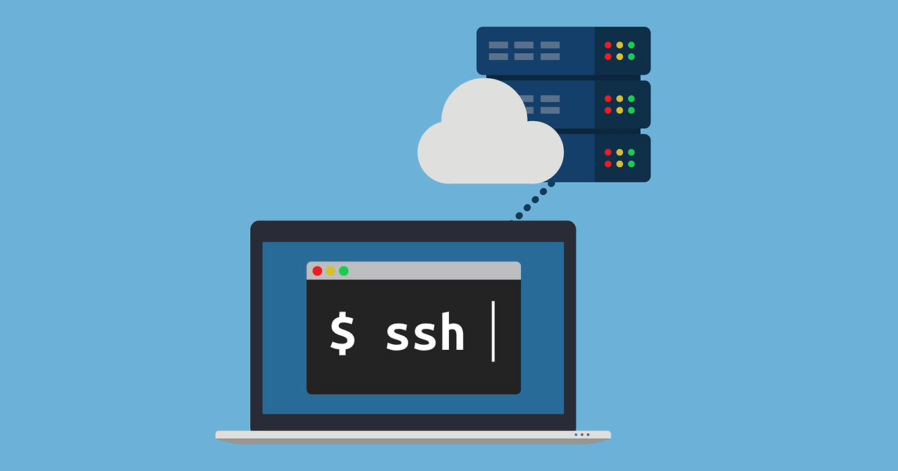
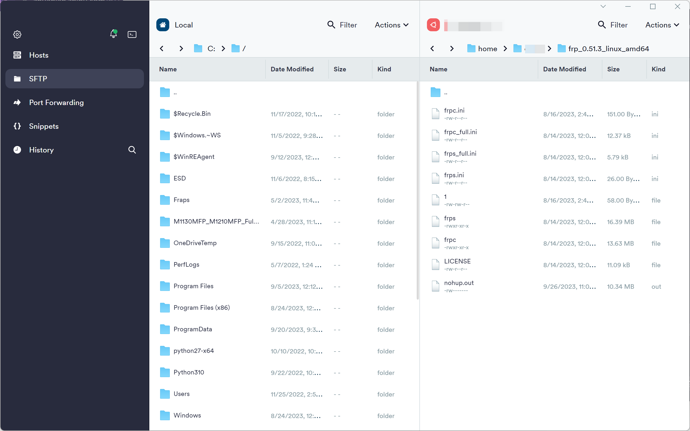

!!! abstract ""

    如果你已经对 Linux 的基础命令和如何使用 ssh 连接服务器和 scp 传输文件比较熟悉，可以跳过此章节。

!!! question ""

    本文档仅包含对 Linux 的简单介绍，覆盖本次作业所需的知识点，如果你想要了解更多关于 Linux 的知识，可以参考 [Linux 基础入门](https://www.runoob.com/linux/linux-tutorial.html)。 

## Linux 简介
Linux 是一种自由和开放源码的类 Unix 操作系统，是自由软件和开源软件中发展最著名的例子，只要遵循 GPL 许可证，任何个人和机构都可以自由地使用 Linux 的所有底层源码，也可以自由地修改和再发布。

Linux 严格来说是单指作系统的内核，因为操作系统中包含了许多用户图形接口和其他工具。如今 Linux 常用来指基于 Linux 内核的完整操作系统，也称为 Linux 发行版。一些流行的主流 Linux 发行版包括 Debian（及其派生版本 Ubuntu、Linux Mint）、Fedora（及其相关版本 Red Hat Enterprise Linux）和 openSUSE 等。

<figure markdown>
{ loading=lazy }
<figcaption>开发者最常用的5个 Linux 发行版</figcaption>
</figure>


Linux 有众多优点，其中较为突出的是：

- 开源、免费：在遵守 GPL 协议的前提下，任何人都可以修改和分发 Linux 的源码，而且不需要支付任何费用。
- 丰富软件工具支持：Linux 拥有丰富的软件工具以及强大的包管理工具，例如 Debian 的 apt、Red Hat 的 yum 等，可以方便地安装、更新和卸载软件。
- 简单、系统占用少、易于裁剪：Linux 的低成本、强大的定制功能以及良好的移植性能，使得 Linux 在嵌入式系统方面也得到广泛应用。

计算机领域的学习无法绕开 Linux，在本次作业中，我们将使用 Linux 来完成作业的部署。

## Linux 文件系统介绍
Linux 的文件系统是一个关键的操作系统组成部分，它负责管理和组织计算机上的数据和文件。它采用了一种分层的树状结构，这个结构从根目录开始，向下扩展到所有存储设备和文件的层次结构。

Linux 的文件系统以根目录（/）为起点，形成一个层次结构。这个树状结构包含了各种目录和文件，每个都有一个唯一的路径来标识它们的位置。

<figure markdown>
{ loading=lazy }
<figcaption>Linux 文件目录</figcaption>
</figure>

Linux 上的用户一般会有自己的家目录，这个目录的路径是 `/home/用户名`，例如 `root` 用户的家目录为 `/root`，`ubuntu` 用户的家目录为 `/home/ubuntu`，家目录使用特殊的符号 `~` 来简写，是用户打开终端时的默认目录。


## Linux 常用命令
本次作业主要采取命令行的形式来完成，因此需要同学们掌握一些基本的 Linux 命令。

- `ls`：列出目录下的文件和文件夹
    
    ```bash
    $ ls . # 列出当前目录下的文件和文件夹，等价于 ls
    $ ls ../ # 列出上一级目录下的文件和文件夹
    ```
- `cd`：切换工作目录
    ```bash
    $ cd ../../ # 切换到上上级目录
    $ cd /home/ubuntu # 切换到 /home/ubuntu 目录
    ```
- `pwd`: 显示当前工作目录
    ```bash
    $ pwd # 显示当前工作目录
    /home/ubuntu # 当前工作目录为 /home/ubuntu
    ```
- `mkdir`/`rmdir`：创建/删除目录
    
    ```bash
    $ mkdir test # 在当前目录下创建 test 目录
    $ rmdir test # 删除当前目录下的 test 目录
    ```
- `cp`: 复制文件或目录
    ```bash
    $ cp test.txt test2.txt # 复制 test.txt 文件为 test2.txt
    $ cp -r test test2 # 复制 test 目录为 test2
    ```
- `cat`: 显示文件内容
    ```bash
    $ cat test.txt # 显示 test.txt 文件的内容
    ```
- `ps`: 查看系统进程状态
    ```bash
    $ ps # 查看当前用户的进程状态
    $ ps -aux # 查看所有用户的进程状态
    $ ps -aux | grep python # 查看所有用户的进程状态，并筛选出包含 python 关键字的进程
    ```
- `lsof -i`: 列出符合条件的进程
    ```bash
    $ lsof -i:8000 # 列出所有占用 8000 端口的进程
    ```
- `kill`: 终止进程
    ```bash
    $ kill -9 1234 # 终止进程号为 1234 的进程
    ```

## SSH 连接
本次作业会为同学们提供腾讯云的 Linux 服务器，那么如何连接到这台服务器呢？这就需要用到 SSH 了。

SSH（Secure Shell）是一种加密的网络传输协议，可以在不安全的网络中为网络服务提供安全的传输环境。SSH 通过在网络中创建安全隧道来实现安全连接，可以有效防止远程管理过程中的信息泄露问题。

通过使用 SSH，我们可以在本地终端中连接到远程服务器，然后在远程服务器上执行命令，就像在本地终端中一样。这样就可以在远程服务器上进行开发了。

<figure markdown>
{ loading=lazy }
<figcaption>本地使用 SSH 通过终端控制远程服务器</figcaption>
</figure>

SSH 的连接可以通过终端或者图形界面来实现

- MacOS 或 Linux 用户可以直接在终端中使用 `ssh` 命令来连接服务器
    ```bash
    $ ssh USER_NAME@IP_ADDRESS
    # USER_NAME 替换为使用的服务器账户的用户名
    # IP_ADDRESS 替换为连接的服务器的 IP 地址
    # 一个具体的例子
    $ ssh root@111.111.111.111
    ```
- Windows 用户可以使用 [Git Bash](https://git-scm.com/download/win)、[cmder](https://cmder.app/) 和 [PowerShell](https://learn.microsoft.com/en-us/powershell/scripting/install/installing-powershell-on-windows?view=powershell-7.3) 等工具来连接服务器

有多种 GUI 工具可供连接服务器：

- 对于 Windows 用户，推荐使用 [MobaXterm](https://mobaxterm.mobatek.net/)、[Xshell](https://www.netsarang.com/zh/xshell/) 和 [PuTTY](https://www.chiark.greenend.org.uk/~sgtatham/putty/latest.html) 等软件。
- MacOS 用户则可以考虑使用 [Termius](https://termius.com/)、[iTerm2](https://iterm2.com/)

相较于传统终端，这些软件提供了更丰富的功能，同时也更为用户友好。

!!! note "首次连接提示"
    
    当首次连接至远程服务器时，系统会询问是否将远程服务器添加到本地的 `known_hosts` 文件。此时，应当按提示输入 `yes` 以确认并继续。


## 上传和下载文件

在日常的开发与维护工作中，我们经常需要与远程服务器交换文件——无论是上传数据至服务器或是从服务器下载资料。为了满足这种需求，我们可以利用 `scp` 命令，它提供了一种安全、高效的方式来传输文件。

`scp` 命令的使用方式与 `cp` 命令类似，但在使用时需要明确远程服务器的用户名、IP 地址，以及文件或目录的绝对或相对路径。

上传文件到远程服务器的基本语法为：

```bash
$ scp SRC/FILE DES/
```
其中 `SRC/FILE` 为本地文件的路径，`DES/` 为远程服务器的路径，例如，要将本地目录下的 `test.txt` 文件上传至远程服务器的 `/home/ubuntu/` 目录，可以这样操作：

```bash
# 将本地当前目录下的 test.txt 文件上传至远程服务器的 /home/ubuntu/ 目录下
$ scp ./test.txt root@111.111.111.111:/home/ubuntu/
```
若要从远程服务器下载文件至本地，则只需交换源与目的路径的顺序：

```bash
# 将远程服务器的 /home/ubuntu/test.txt 文件下载至本地当前目录下
$ scp root@111.111.111.111:/home/ubuntu/test.txt ./
```

如果需要下载整个目录，可以使用 `-r` 选项

```bash
$ scp -r SRC/ DES/
```
注意，使用 `-r` 选项下载整个目录时，不应指定具体的文件名。

---

相对而言，GUI 提供了更加直观的方式来上传和下载文件。以 Termius 为例，上传文件只需在左侧的文件管理器中找到本地文件，然后将其拖拽至右侧的远程服务器文件管理器中即可。

<figure markdown>
{ loading=lazy }
<figcaption>通过 Termius 上传和下载文件</figcaption>
</figure>