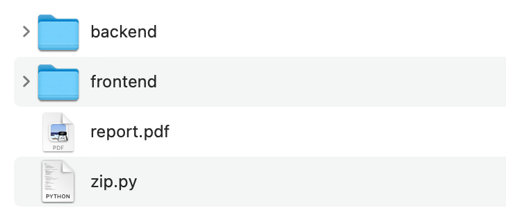

# 提交说明

在完成任务后，同学们需要将 `report.pdf` 替换为自己的实验报告，报告中需要至少包括如下内容：

- 简要描述 Docker 部署部分的实现思路以及体会；

报告需要是 `pdf` 格式，命名为 `report.pdf`，放置在项目的根目录下，导出时请注意图片的显示是否正常。

最终的项目结构如下：
<figure markdown>
{ loading=lazy }
<figcaption>目录结构</figcaption>
</figure>

在完成实验报告后，同学们在项目的根目录下执行如下命令获取压缩包文件：
```shell
# 在项目根目录下运行
# 将文件夹压缩为 清小软_2021000000.zip
$ python zip.py 清小软 2021000000
```
**禁止修改无 `TODO` 标注的文件以及添加新文件**，压缩时第一个参数为姓名，第二个参数为学号。

提交压缩包文件 `姓名_学号.zip` 到网络学堂。


!!! danger "提交注意事项"
    如果提交时压缩失败，请根据提示信息检查是否包含了**无关文件**或**修改了没有 `TODO` 标记**的文件。

    请务必**使用 `zip.py` 脚本进行压缩**，使用其他压缩方式将视为不符合规范的提交，并可能导致<span style="color:red;">**扣分**</span>处理。