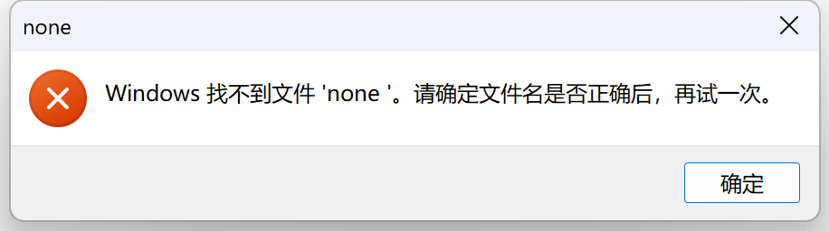

# 作业要求

!!! warning "前置要求"
    在进行本次作业前，请先阅读[清软论坛说明](../bbs.md)，**确保**对项目的基本操作和开发流程有所了解。

## 代码风格测试
在该部分中，你需要为SimpleBBS增加代码风格检查，要求如下：

* 完善flake8配置文件

    * 忽略并仅忽略以下文件夹： **`.git`**文件夹、所有 **`__pycache__`** 文件夹、所有 **`migrations`** 文件夹
    * 设置单行代码的最大长度为 **100** 字符
    * 配置特定文件的错误忽略：
        * 忽略 `tests/test_api.py`、`driver.py` 的 **E501** 错误
        * 忽略 `user/views.py` 的 **E722** 错误
        * 忽略 `app/settings_prod.py` 的 **F401** 和 **F403** 错误
    
* 完善格式化流程，将格式化和代码检查任务整合到`Makefile` 中，执行如下命令：

    * 使用 `autopep8` 对代码自动格式化
    * 使用 `autoflake` 对代码自动格式化
    * 使用 `isort` 对代码自动格式化
    * 使用 `flake8` 检查代码风格

* 评测时执行脚本检测是否正确格式化且符合 flake8 格式，评测流程如下：
    ```shell
    make lint
    echo $?
    ```
    `echo $?`将返回上一条命令的退出状态。如果返回值为 `0`，则表示代码格式化正确且通过了 `flake8` 检查；如果返回非零值，则表示代码未通过检查。
    在 Windows 系统下，`$?` 的语义有所不同，可以使用 `echo $LASTEXITCODE` 来获取上一条命令的退出状态。

!!! info "正确性检查"
    经过正确配置 `autoflake`、`autopep8`、`isort` 对代码自动格式化后，执行 `flake8` 检查代码风格时，**不会输出任何错误或警告**。
## 单元测试
测试时请使用下面的命令

```bash
# 在 backend 目录下
python manage.py test --filter test_basic
```

补充基础函数和单元测试分别占 50%

在该部分中，同学们需要以**测试驱动开发的方式**补完下列函数，并使用 unittest 补充相应的单元测试

1. `register_params_check` 函数，该函数在 **`utils/register_params_check.py`** 文件中，实现注册账号 API 参数的校验。接收参数如下：

    * `username`: 必填，用户账号
    * `password`: 必填，用户密码
    * `nickname`: 必填，用户昵称
    * `mobile`: 必填，手机号
    * `url`: 必填，用户个人地址链接
    * `magic_number`: 选填，用户喜欢的幸运数字

    **参数要求：**

    - 用户账号为长度 5-12 的字母串加数字，且必须包含这两种类型，所有字母串必须在数字前面，大写字母和小写字母均合法
    - 用户密码为长度 8-15 的字符串，由大写、小写字母、数字和标点符号组成且必须包含这四种类型，有效的标点符号为-_*^
    - 用户的手机号的格式为+[区号].[手机号]，其中区号必须为两位数字，手机号必须为 **12** 位数字，例如+12.123456789012
    - 用户的个人地址链接包含协议和域名两部分
        - 协议部分必须为 http:// 或者 https://
        - 域名部分包含 1 到多个点 `.`，表示以点 `.` 分隔的标签序列，且总长度不超过 48 个字符（包含 `.`）。标签序列只能由下列字符组成：
            - 大小写字母 `A` 到 `Z` 和 `a` 到 `z`
            - 数字 `0` 到 `9`，但最后一段顶级域名不能是**纯数字**（如 `163.com` 可以但 `163.126` 不可以）
            - 连字符`-`，但不能作为首尾字符
    - magic_number为非负数 <span style="color: red">int</span> 数值，可选参数（在设计测试用例时无需考虑最大值上界）

    **返回值要求：**

      * 返回错误或缺失字段名（如有多个只需要按前述顺序返回第一个）以及一个 bool 值表示是否出错，这表示你需要按上述顺序**依次**检查每一个字段是否缺失或错误
      * 如果正确，返回 `"ok"` 以及 `True`
      * 如果 magic_number 缺失，请为 content 添加默认值为 0 的 magic_number 字段

    **黑盒测试参数提示：**

      * 传入的内容为 `JSON` 格式，其中 `Key` 可能为任何值，只需关注有用的字段即可，多余的 `Key` 忽略
      * 传入的 `JSON` 格式的内容中，`Key` 对应的值可能不是预期的类型

2. 对 `register_params_check` 补充单元测试
    
    请在 `tests/test_basic.py` 的 `TODO` 处补充相应的单元测试，并使得 `register params check.py` 行覆盖率不低于 <span style="color: red">80％</span>，在文档中说明的所有测试用例应在测试代码中有完整体现。


## 集成测试
测试时请使用下面的命令

```bash
# 在 backend 目录下
python manage.py test --filter test_api
```

在该部分中，同学们需要为 SimpleBBS 添加集成测试，请补充 `tests/test_api.py` 中的 `TODO` 部分为注册路由、登录路由和登出路由添加测试，提供了部分注册路由测试代码供同学们参考。

同学们不需要自己构造测试样例，测试中已经构造了一个用户，具体信息请阅读 `tests/test_api.py` 中 `APITestCase` 类的 `setUp` 函数。

## 端到端测试
测试时请使用下面的命令
```bash
# 在 backend 目录下
python manage.py test --filter test_e2e
```

在该部分中，同学们需要在 `tests/test_e2e.py` 中使用 unittest 框架和 selenium 为 SimpleBBS 补充端到端测试，selenium 提供了自动化控制浏览器的能力，同学们需要使用 selenium 控制浏览器实现用户的登录、发帖、更新帖子、登出等操作，在 `tests/test_e2e.py` 中提供了实现自动登录的部分供同学们参考。

由于 selenium 需要用到 WebDriver 控制浏览器，可在如下链接下载对应浏览器类型及版本的 WebDriver ，并放置于 `drivers` 目录，将 `tests/test_e2e.py` 中的 `DRIVER_PATH` 变量指向 WebDriver 的实际路径，如果出现错误请首先仔细阅读 [环境搭建](./setup.md) 章节的内容。 


!!! question "注意事项"
    - 端到端测试需要使用浏览器和前端，但是由于助教已经在测试文件中启动了前端，所以你并不需要手动启动。
    - 为了进行端到端的测试，后端同样会使用 8000 端口。因此，在开始测试之前，请确保**关闭**之前启动的后端服务，以避免**端口冲突**。
    - 禁止通过直接访问**客户端路由**进行页面跳转。在端到端测试中，页面跳转必须通过**点击按钮等用户操作**实现，不允许通过修改 URL 或使用客户端路由来实现页面跳转，否则将<span style="color:red;">**扣除相应分数**</span>。

!!! note "Windows 用户注意事项"
    使用 Windows 的同学在运行端到端测试时可能会出现如下提示
    
    这是正常现象，不会影响测试结果，点击 `确定` 即可。

## 评测说明
- “代码风格测试”部分的评测采用脚本对代码风格进行检查，正确通过即可全分；
- “单元测试”部分采用黑盒脚本对基础函数进行测试，正确通过测试用例即可全分，单元测试人工评测，覆盖率达到要求，测试用例设计恰当合理即可全分；
- “集成测试”部分采用 Monkey Patch 对集成测试进行测试，同学们按照顺序正确测试路由函数即可全分
- “端到端测试”部分采用 Monkey Patch 对端到端测试进行测试，同学们按照顺序正确控制浏览器即可全分
- DDL 日期之后，按照 $0.9^{迟交天数}$ 的衰减系数计算分数，迟交时间未满一天记作一天，最多不超过一周，一周后不再接受作业。
