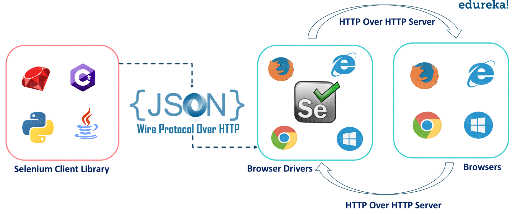

# 测试

测试驱动开发（Test-Driven Development，简称 TDD）是一种软件开发方法，它依赖于编写测试来驱动整个开发过程。TDD 的基本思想是在编写任何新的功能代码之前，首先编写测试。这些测试最初会失败，因为功能代码还不存在。然后，开发者编写最少量的代码来使测试通过，最后重构代码以达到最佳实践。

TDD 的过程通常遵循“红-绿-重构”（Red-Green-Refactor）的循环：

1. **红色阶段**：首先编写一个失败的测试。这个测试应该基于你想要实现的新功能。

2. **绿色阶段**：编写代码使测试通过。在这个阶段，你的目标是尽快让测试通过，即使这意味着你的代码不是最优的。

3. **重构阶段**：在测试通过后，你可以重构代码，以去除重复的代码，提高代码的可读性，或者使用更好的设计模式等。在重构阶段，你可以放心地修改代码，因为你有测试来保证你的修改不会破坏现有的功能。

因此测试在现代软件开发中是非常重要的，它可以帮助我们提高代码的质量，减少 bug 的产生，提高代码的可读性，降低代码的维护成本。在本次作业中，我们将学习如何在软件开发中进行代码风格测试、单元测试、集成测试和端到端测试。


## 代码风格测试
统一的代码风格具有多种重要的优点，这些优点不仅对个人开发者有益，对团队协作也至关重要。

首先，统一的代码风格可以显著提高代码的可读性和质量。当所有的代码都遵循同一套规则和约定时，阅读和理解代码将变得更加容易。这对于代码的维护和调试都非常有帮助，因为开发者可以更快地理解代码的结构和功能。

其次，统一的代码风格可以减少团队沟通的成本。在团队开发中，开发者需要阅读和理解其他人的代码。如果每个人都有自己的代码风格，那么理解他人的代码将需要更多的时间和精力。而统一的代码风格可以使所有的代码看起来都很相似，从而减少了理解代码的难度。

最后，统一的代码风格也有其美学价值。良好、一致的代码风格可以使代码看起来更加整洁和有序，这不仅可以提高开发者的工作效率，也可以使开发者在编写和阅读代码时有更好的心情。

因此，无论是从提高代码质量、减少沟通成本，还是从美学和心理健康的角度来看，统一的代码风格都是非常有益的。

代码风格检查有多种工具，下面是一些常用的工具：

- [flake8](https://flake8.pycqa.org/en/latest/)：检查代码风格和错误。
- [autoflake](https://github.com/PyCQA/autoflake)：自动删除无用的导入和变量。
- [autopep8](https://pypi.org/project/autopep8/)：自动修复代码风格错误。
- [isort](https://github.com/PyCQA/isort)：自动对导入进行排序和格式化。

以上几种工具均可以使用 `pip` 进行安装。

- `flake8` 可以自动检查代码是否符合 PEP8 规范。
    ```shell
    $ flake8 .
    ```
- `autoflake` 和 `autopep8` 可以自动修复不符合规范的代码。
    ```shell
    $ autoflake .
    $ autopep8 --in-place --recursive .
    ```
- `isort` 可以自动对导入进行排序和格式化。
    ```shell
    $ isort .
    ```
这些工具都支持通过**配置文件**的形式来配置检查规则，以 `flake8` 为例，在运行 `flake8` 的目录下创建 `.flake8` 文件，那么在运行时会自动读取该文件中的配置。

## 单元测试
单元测试是软件开发中的一种测试方法，它的主要目标是验证代码中的最小可测试单元（通常是函数、方法或类）是否按预期工作。每个单元测试都应该是独立的，可以单独运行，而不依赖于任何其他代码或外部资源。

单元测试的重要性和必要性主要体现在以下几个方面：

1. **错误检测**：单元测试可以帮助开发者在早期发现代码中的错误或问题，这样可以在问题变得更复杂和难以解决之前进行修复。

2. **代码质量**：通过编写单元测试，开发者可以确保代码的质量，因为这迫使他们写出可测试的、模块化的代码，这样的代码更容易理解和维护。

3. **简化重构**：当你需要修改或重构代码时，有了单元测试，你可以更有信心地进行，因为你知道如果你的修改破坏了现有的功能，测试将会失败。

4. **文档**：单元测试也可以作为一种形式的文档，它们可以显示代码的预期行为，并为其他开发者提供示例代码。

5. **回归测试**：当你添加新功能或修复错误时，单元测试可以确保你没有破坏现有的代码。

本次作业中使用 Python 的 unittest 模块来编写单元测试，具体可以参考 [unittest 文档](https://docs.python.org/zh-cn/3/library/unittest.html)。

在使用 unittest 编写单元测试时，测试通常以类的形式进行组织，并且这些类会继承自 `unittest.TestCase` 类。这种设计允许我们将相关的测试逻辑集中在一起，同时利用继承自 `unittest.TestCase` 的类提供的各种测试工具和方法。

每个具体的测试用例则以函数的形式存在于这些类中，这些函数的名称通常以 `test_` 为前缀。这是一个约定，unittest 框架会自动运行所有以 `test_` 开头的方法作为测试用例。这种设计使得每个测试用例都可以作为一个独立的函数进行编写和运行，提供了很大的灵活性。

举例来说，如果想要测试 Python 中 String 类的 `upper()` 方法和 `isupper()` 方法，可以编写如下的测试用例：

```python
import unittest

class TestStringMethods(unittest.TestCase):

    def test_upper(self):
        self.assertEqual('foo'.upper(), 'FOO')
        with self.assertRaises(TypeError):
            raise TypeError

    def test_isupper(self):
        self.assertTrue('FOO'.isupper())
        self.assertFalse('Foo'.isupper())
        with self.assertRaises(TypeError):
            raise TypeError
```
可以直接在 `__main__` 中运行该测试用例：
```python
if __name__ == '__main__':
    unittest.main()
```

同时，你也可以选择使用命令行来运行这些测试用例，我们将上述测试类代码保存到名为 `test.py` 的文件中，并运行如下命令
```shell
$ python -m unittest test.py
```

在运行完测试用例之后，可能需要对测试用例的覆盖率进行统计，这时可以使用 `coverage` 工具，具体使用方法可以参考 [coverage 文档](https://coverage.readthedocs.io/en/7.2.7/)。

使用 `coverage` 的命令行工具以统计覆盖率：
```shell
# 运行测试
$ coverage run test.py
# 命令行中生成覆盖率报告
$ coverage report
# 生成 HTML 格式的覆盖率报告，通过 htmlcov/index.html 查看
$ coverage html
```


<figure markdown>
{loading=lazy}
<figcaption>网页版本的覆盖率报告</figcaption>
</figure>


## 集成测试

集成测试（Integration Testing）是软件开发生命周期中的一个重要阶段，它是在单元测试之后进行的。在单元测试中，开发者会测试单个模块或组件的功能。然而，单元测试并不能保证这些模块或组件在一起工作时也能正常运行。这就是集成测试的目的：验证多个模块或组件在一起工作时的行为。
集成测试的主要步骤包括：

1. **模块组合**：根据系统设计，将各个模块按照特定的顺序组合在一起。这个顺序通常是根据模块之间的依赖关系来确定的。

2. **测试**：运行组合后的模块，并检查它们是否能够正确地一起工作。这包括检查数据是否能够正确地在模块之间传递，以及模块是否能够正确地响应其他模块的行为。

3. **错误修复**：如果在测试中发现了错误，那么需要修复这些错误，然后重新进行测试，直到所有的模块都能够正确地一起工作。

集成测试能够检查模块间的交互，往往能发现全局级别的问题。

本次作业使用 `Django` 自带的 `unittest` 框架来编写集成测试，具体可以参考 [Django 文档](https://docs.djangoproject.com/en/4.1/topics/testing/overview/)。

你需要做的是补全 `tests/test_api.py` 中被标注为 `TODO` 的测试用例，然后运行如下命令：
```shell
$ python manage.py test --filter test_api
```
评测时按照顺序正确测试对应路由即可获取这部分分数

## 端到端测试
端到端测试（End-to-End Testing）是软件测试的一种类型，它的目标是验证**整个系统或应用**从开始到结束是否按预期工作。这种测试方法涵盖了所有的交互路径，包括所有的子系统和服务，以及它们之间的交互。端到端测试的目标是模拟真实用户场景，以确保整个系统在所有的组件和服务一起工作时能够正常运行。

相比起前两种测试，端到端测试

- 通过添加比其他测试方法（如单元和功能测试）更详细的测试案例，扩大测试范围。
- 通过运行基于终端用户行为的测试用例，确保应用程序的正确执行。
- 通过自动化关键用户路径缩短应用测试周期。
- 通过减少测试软件的时间，降低构建和维护软件的总体成本。
- 有助于可预测地、可靠地检测错误。

有众多工具进行端到端测试，例如 Selenium、Cypress、TestCafe 和 PlayWright 等。本次作业使用 Selenium 进行端到端测试，Selenium是一个用于Web应用程序测试的工具，**直接运行在浏览器中**，模拟真正的用户操作，测试应用程序功能，验证用户的实际需求。具体可以参考 [Selenium 文档](https://www.selenium.dev/documentation/en/)。


<figure markdown>
{loading=lazy}
<figcaption> Selenium 通过多种语言的 Binding 与浏览器进行交互
</figcaption>
</figure>

下面以一个简单的例子来说明 Selenium 的使用方法。假设我们要测试的网页是 `https://www.baidu.com`，我们可以使用 Selenium 的 Python Binding 来编写测试用例：
```python
# test_selenium.py
from selenium import webdriver
from selenium.webdriver.common.keys import Keys
from selenium.webdriver.common.by import By
import time
driver = webdriver.Chrome('drivers/chromedriver.exe')
driver.get("http://www.baidu.com")
assert "百度" in driver.title
# https://selenium-python.readthedocs.io/locating-elements.html
elem = driver.find_element(By.NAME, "wd")
elem.clear()
elem.send_keys("软件工程")
elem.send_keys(Keys.RETURN)
time.sleep(5)
driver.close()
```
将 Driver 放在项目 `backend` 目录下的 `drivers` 文件夹中，然后运行：
```shell
# 在 backend 目录下运行
$ python driver.py
```
你会发现浏览器自动打开，然后在搜索框中输入 `软件工程`，然后自动检索，在等待 10 秒后自动关闭浏览器。

在本次作业中，你需要补全 `tests/test_e2e.py` 中被标注为 `TODO` 的测试用例，然后运行如下命令：
```shell
$ python manage.py test --filter test_e2e
```
